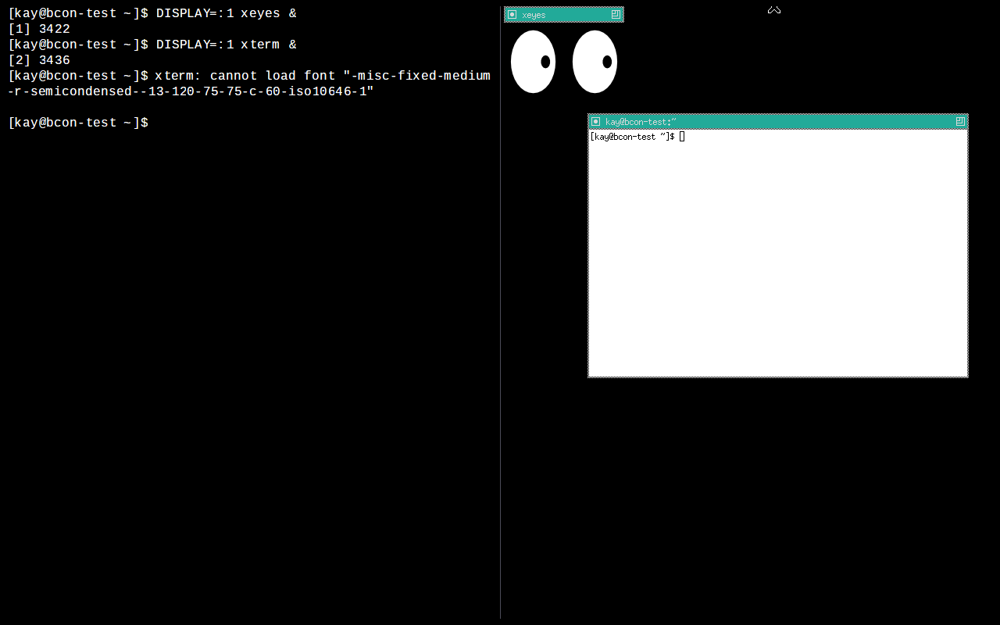

# Xkitty

A lightweight KDrive-based X server that renders to any terminal supporting the [Kitty Graphics Protocol](https://sw.kovidgoyal.net/kitty/graphics-protocol/).

Run X11 applications (xeyes, xterm, twm, etc.) directly inside your terminal — no X11 display server or Wayland compositor required.



## How It Works

Xkitty is a fork of [xserver-SIXEL](https://github.com/aspect-ux/xserver-SIXEL) with the SIXEL output backend replaced by the Kitty Graphics Protocol. It captures the X11 framebuffer, converts it to RGB, optionally compresses it with zlib, and sends it to the terminal via Kitty Graphics escape sequences.

### Transfer Modes

| Mode | Flag | Description |
|------|------|-------------|
| Tempfile | `-kitty-transfer t` (default) | Writes frame data to `/tmp/xkitty-frame.bin`, sends path to terminal |
| Shared Memory | `-kitty-transfer s` | Uses POSIX `shm_open` — no file I/O overhead |
| Direct | `-kitty-transfer d` | Sends base64-encoded data inline (slowest, most compatible) |

### Optimizations

- **Dirty rectangle tracking** — only converts changed screen regions (XRGB to RGB)
- **zlib compression** — typically reduces frame data by 99%+ (`-nocompress` to disable)
- **Frame rate cap** — throttles output to ~60 fps to avoid wasting bandwidth
- **Fixed image ID** (`i=1`) — prevents texture cache overflow in the terminal

## Requirements

### Terminal

A terminal emulator with Kitty Graphics Protocol support. Tested with:

- [bcon](https://github.com/user/bcon) (GPU-accelerated console terminal)
- Other Kitty Graphics-capable terminals should work (kitty, WezTerm, Ghostty, etc.)

For tempfile (`t=t`) and shared memory (`t=s`) transfer modes, the terminal must allow remote file/memory access (typically enabled by default).

### Runtime

- `libXfont2`
- `xorg-xkbcomp` (or `x11-xkb-utils`)

## Building

Xkitty builds inside a Docker/Podman container (Debian bookworm):

```bash
# Build the container image
docker build -t xkitty-build -f Dockerfile .

# Build the Xkitty binary
docker run --rm -v ./:/output xkitty-build \
  bash -c "./build-xkitty-debian.sh && cp hw/kdrive/sixel/Xkitty /output/Xkitty"
```

The resulting `Xkitty` binary (~1.8 MB) is statically linked against the X server libraries.

### Install

```bash
sudo cp Xkitty /usr/local/bin/Xkitty
sudo chmod +x /usr/local/bin/Xkitty
```

## Usage

```bash
# Basic usage — starts X on display :1 with twm window manager
Xkitty :1 -screen 800x600 -noreset -exec twm

# With shared memory transfer (recommended)
Xkitty :1 -screen 800x600 -noreset -kitty-transfer s -exec twm

# Without compression
Xkitty :1 -screen 800x600 -noreset -kitty-transfer s -nocompress -exec twm
```

Then, in another terminal (or pane):

```bash
export DISPLAY=:1
xeyes &
xterm &
```

### Stopping

Xkitty runs in raw terminal mode, so Ctrl+C does not work. Use:

```bash
pkill Xkitty
```

### Options

| Option | Description |
|--------|-------------|
| `:N` | X display number (e.g., `:1`) |
| `-screen WxH` | Screen resolution (e.g., `800x600`) |
| `-noreset` | Don't reset when last client disconnects |
| `-kitty-transfer t\|d\|s` | Transfer mode: tempfile, direct, or shared memory |
| `-nocompress` | Disable zlib compression |
| `-exec CMD` | Run CMD as the initial X client |

## Architecture

```
X11 Clients (xeyes, xterm, twm, ...)
        |
        v
  +-----------+
  |  Xkitty   |  KDrive X Server
  |           |  Shadow framebuffer (32bpp XRGB)
  |           |     |
  |           |  Dirty rect XRGB->RGB conversion
  |           |     |
  |           |  zlib compression (optional)
  |           |     |
  |           |  Kitty Graphics Protocol output
  +-----------+  (t=t, t=s, or t=d)
        |
        v
  Terminal Emulator (Kitty Graphics Protocol)
```

## Lineage

```
xorg-server (X.Org Foundation)
  -> xserver-SIXEL (SIXEL graphics output)
    -> Xkitty (Kitty Graphics Protocol output)
```

## Acknowledgments

- [**@sanohiro**](https://github.com/sanohiro) — Author of [bcon](https://github.com/sanohiro/bcon), the GPU-accelerated console terminal that inspired this project. Xkitty was built to bring arbitrary X11 applications to bcon's Kitty Graphics Protocol renderer.
- [**Hayaki Saito**](https://github.com/saitoha) — Author of [xserver-SIXEL](https://github.com/saitoha/xserver-SIXEL), the SIXEL-output KDrive X server that Xkitty is forked from. Without this pioneering work, Xkitty would not exist.
- **The X.Org Foundation** — For the X server codebase and KDrive framework.

## License

MIT License — see [LICENSE](LICENSE) for details.

This project inherits the MIT license from the X.Org X server. See copyright headers in individual source files for per-file attribution.
